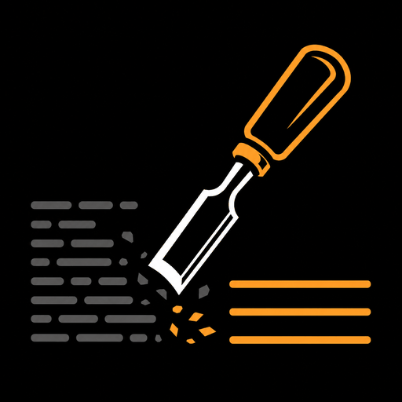
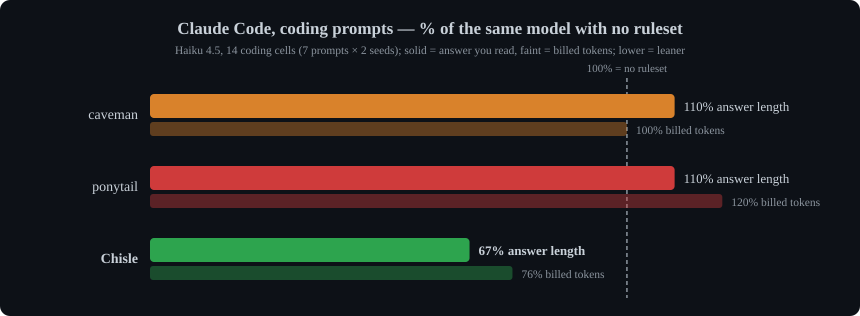
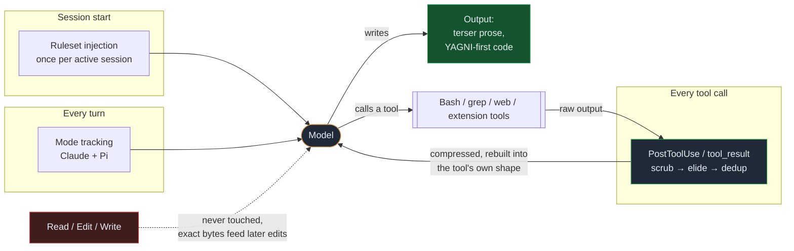
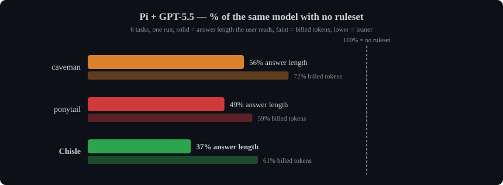
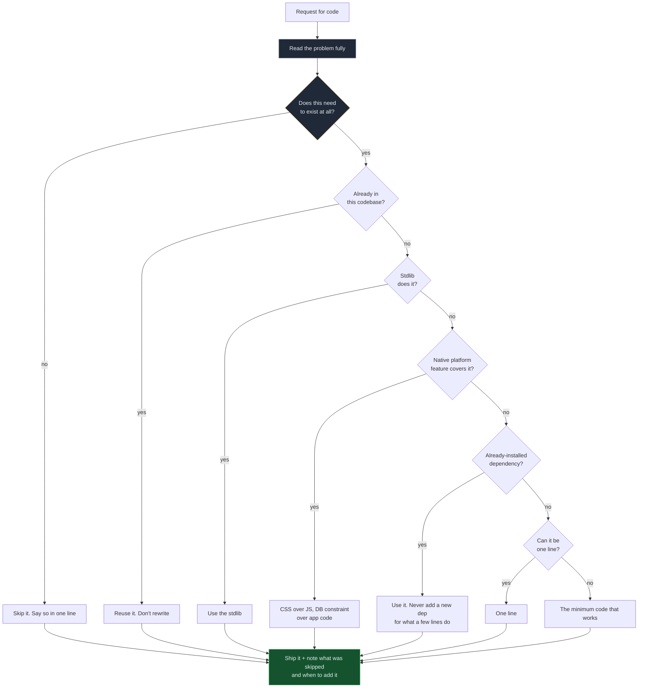

<p align="center">
  
</p>

<h1 align="center">Chisle</h1>

<p align="center">
  <em>Your AI talks less, builds less, reads less, and says more. Like a senior dev who bills by the syllable.</em>
</p>

<p align="center">
  <em>The only tool in this class that publishes the runs where it lost. <a href="https://jaypokale.me/writing/chisle-benchmarks-it-loses">Here's why.</a></em>
</p>

<p align="center">
  <a href="https://www.npmjs.com/package/chisle"></a>
  
  <a href="https://github.com/JayPokale/Chisle/actions/workflows/test.yml"></a>
  
  
  <a href="https://github.com/JayPokale/Chisle/stargazers"></a>
</p>

<p align="center">
  <strong>Built for Claude Code: coding answers come back 33% shorter and 24% cheaper, while caveman and ponytail make them longer &middot; 12 agents &middot; zero dependencies &middot; one command</strong>
</p>

Chisle is a Claude Code plugin that makes Claude cheaper to run without making it dumber. It cuts what Claude writes: no filler, no hedging, no speculative abstractions, just the smallest code that works. It also cuts what Claude reads: a `PostToolUse` hook trims oversized tool output by ~46% before it re-enters the context window, where it would be re-billed on every later request. In agent-loop tests Claude with Chisle passes the same tasks as Claude without it. One `npx chisle` installs it, and the same ruleset ships to Pi, Cursor, Codex, Gemini, Copilot, OpenCode, Antigravity and four more agents. Every number here comes from committed raw transcripts, including the runs where it lost.

<p align="center">
  
</p>

<p align="center"><sub>Claude Code 2.1.285 on Haiku 4.5, the 14 coding cells of a 26-cell run. Across all 26 prompts Chisle bills 83% where caveman bills 102% and ponytail 105%, the only one under 100%; on short answers it breaks even. <a href="#benchmarks">Full numbers below.</a></sub></p>

---

"Add debounce to a search input that currently fires an API call on every keystroke." Same model, same prompt, one difference: the injected ruleset. Both answers below are the **verbatim committed output** from [`benchmarks/results/raw/`](benchmarks/results/raw/):

<table>
<tr><th align="left" width="50%">bare agent: 142 lines, 1506 tokens</th><th align="left" width="50%">Chisle: 35 lines, 602 tokens</th></tr>
<tr valign="top"><td>

Opens with *"Let me show you the most common approaches"*, then ships a reusable generic `useDebounce<T>` hook in its own file…

```typescript
// useDebounce.ts
export function useDebounce<T>(
  value: T, delay: number
): T {
  const [debouncedValue, setDebouncedValue]
    = useState<T>(value);
  useEffect(() => { /* … */ }, [value, delay]);
  return debouncedValue;
}
```

…then **Option 2** and **Option 3**, a comparison table, and a caveats section.

</td><td>

Asks which framework, then answers the question that was actually asked: `setTimeout` in the effect you already have, no new file, no generic:

```jsx
useEffect(() => {
  const timer = setTimeout(async () => {
    if (query.trim()) { /* fetch */ }
  }, 300);
  return () => clearTimeout(timer);
}, [query]);
```

Then two lines on why it works, and *"use `lodash.debounce` if already installed."*

</td></tr>
</table>

Not golfed, **boring**. Same behaviour, one less abstraction, no second file, and it names the dependency you might already have instead of reinventing it.

## What it compresses

| axis | what | how |
|---|---|---|
| **Output: prose** | filler, hedging, manufactured structure | zero-fluff ruleset, injected per session |
| **Output: code** | speculative abstractions, unrequested boilerplate | YAGNI efficiency ladder |
| **Input: context** | oversized tool output flooding the window | Claude `PostToolUse` / Pi `tool_result`: scrub, elide, dedup, plus prevention rules |

Where each one attaches to a session:



The loop on the right is the input axis: tool output is billed again on *every* later request in the session, so shrinking it once pays repeatedly. `Read`, `Edit`, and `Write` are deliberately outside it.

---

## Install

One command. Auto-detects your agents (Claude Code, Pi, Cursor, Windsurf, Cline, Kiro, Antigravity, Codex, Gemini, Copilot, OpenCode, Hermes) and wires each one. `--uninstall` puts everything back.

```bash
npx chisle
```

```bash
# or via curl
curl -fsSL https://raw.githubusercontent.com/JayPokale/Chisle/main/install.sh | bash
```

```powershell
# Windows
irm https://raw.githubusercontent.com/JayPokale/Chisle/main/install.ps1 | iex
```

Preview first with `npx chisle --dry-run`, scope with `--only claude` or `--only pi`, see everything with `npx chisle --help`. Remove with `npx chisle --uninstall`.

Upgrading, per-agent setup, `--stats` and config: [docs/usage.md](docs/usage.md).

---

## Benchmarks

Claude Code 2.1.285 on Haiku 4.5, 13 live prompts × 2 seeds = 26 cells per arm, billed output tokens vs the same model with no ruleset ([writeup + raw cells](benchmarks/results/2026-10-01-live-rerun.md)):

<p align="center">
  
</p>

| | total bill | 95% CI | visible answer | worst cell | backfires |
|---|--:|--:|--:|--:|--:|
| caveman | 102% | 79–128% | 105% | 305% | 15 / 26 |
| ponytail | 105% | 86–129% | 97% | 493% | 16 / 26 |
| **Chisle** | **83%** | **69–95%** | **76%** | **170%** | **11 / 26** |

Chisle is the only arm below a bare model. It pays on long answers (77%) and coding prompts (76%); on short answers it breaks even (106%).

On Pi + GPT-5.5 Chisle again gives the shortest answers, 37% the length of a bare model's (caveman 56%, ponytail 49%), though on total billed tokens ponytail edges it, 59% to 61%:

<p align="center">
  
</p>

**Input side:** tool output is 67.5% of context in 171 measured Claude Code sessions, and it is re-billed on every later request. The compressor cut ~46% off every eligible output there, and 27.4% of tool output on top of Pi's own truncation ([receipts](benchmarks/results/2026-07-07-input-axis.md)).

|  | prose | code judgment | input/context | worst-case guard | publishes failures |
|---|:---:|:---:|:---:|:---:|:---:|
| caveman | ✅ | ❌ | ❌ | ❌ 305% | ❌ |
| ponytail | ❌ | ✅ | ❌ | ❌ 493% | ❌ |
| headroom | ❌ | ❌ | ✅ proxy | n/a | ❌ |
| **Chisle** | ✅ | ✅ | ✅ hook | **170%** | ✅ |

Every table, chart and caveat, including the June suite and the Pi run in full: [docs/benchmarks.md](docs/benchmarks.md). Head to head: [docs/comparison.md](docs/comparison.md).

---

## How it works

Before writing code, the agent stops at the first rung that holds:



The ladder runs **after** reading, never instead of it. Note the exit: every rung lands on the same obligation: say what you skipped, so "later" doesn't quietly become "never".

The ladder runs *after* reading the code, lazy about the solution and never about understanding. Lazy is not negligent: trust-boundary validation, data-loss handling, security, and accessibility are never on the chopping block.

Mark deliberate simplifications so "later" doesn't quietly become "never":

```js
// chisle: global lock, per-account locks if throughput matters
// chisle: O(n) scan, index this when table exceeds ~10k rows
```

## Usage

| Command | Effect |
|---------|--------|
| *(nothing)* | On automatically every session after install |
| `/chisle` | Re-activate if you'd stopped it |
| `/chisle off` | Deactivate |
| `stop chisle` | Deactivate (ruleset *and* input-side compression) |
| `normal mode` | Deactivate |

Natural language works too: "activate chisle", "chisle mode", "chislify this". Code symbols, function/API names, and error strings stay verbatim, so only the noise around them compresses.

---

## Contributing

See [CONTRIBUTING.md](CONTRIBUTING.md). Built by [Jay Pokale](https://github.com/JayPokale) with [Claude](https://claude.com/claude-code), [Antigravity](https://antigravity.google), and [Codex](https://openai.com/blog/openai-codex/) as co-engineers.

## Star History

<a href="https://www.star-history.com/?repos=JayPokale%2FChisle&type=date&legend=top-left">
  <picture>
    <source media="(prefers-color-scheme: dark)" srcset="https://api.star-history.com/svg?repos=JayPokale/Chisle&type=date&legend=top-left&theme=dark">
    <source media="(prefers-color-scheme: light)" srcset="https://api.star-history.com/svg?repos=JayPokale/Chisle&type=date&legend=top-left">
    
  </picture>
</a>

## License

[MIT](LICENSE). The shortest license that works.

## Contributors

<a href="https://github.com/JayPokale/Chisle/graphs/contributors">
  
</a>

**AI co-engineers** (pair-work credited in commit trailers and the changelog):

<p>
  <a href="https://claude.com/claude-code"></a>
  <a href="https://openai.com/codex/"></a>
  <a href="https://antigravity.google/"></a>
</p>

---

<p align="center">
  Saved you tokens? <a href="https://github.com/JayPokale/Chisle">⭐ Star the repo</a>. It costs zero tokens and keeps the benchmarks running.
</p>
