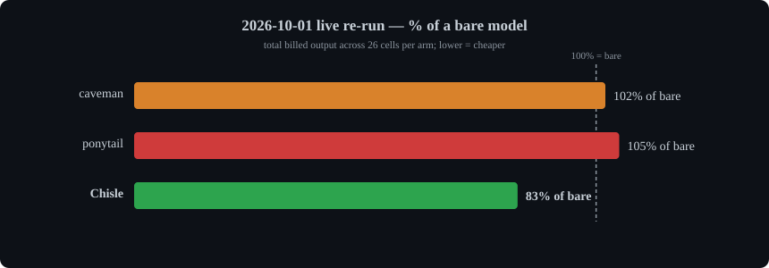
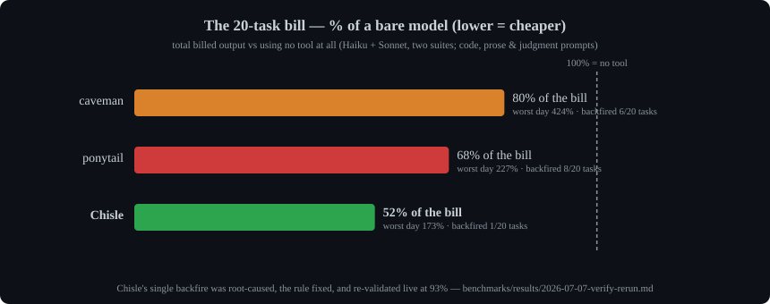
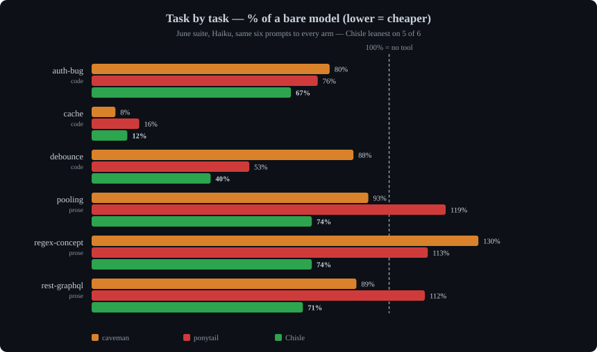
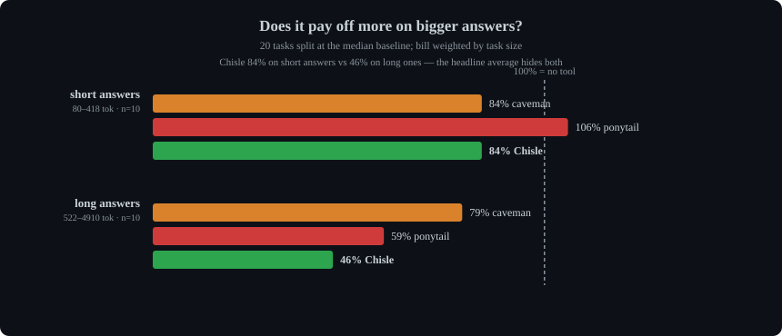
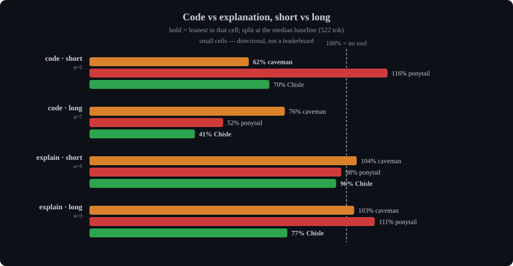

# Benchmarks

Every result behind the [README](../README.md) headline, in full.

Nothing here is estimated. Every figure below is recomputed from committed raw data; the 2026-07-07 [verification writeup](../benchmarks/results/2026-07-07-verify-rerun.md) re-derived the old claims from scratch, re-ran the whole suite against the competitors' **installed plugins**, and retired the one claim that didn't survive.

## Output axis, re-measured 2026-10-01 (current)

Re-run with the shipped ruleset, Claude Code 2.1.285 and the rivals' current plugins (caveman `ef6050c5e184`, ponytail 4.8.3): 13 live prompts × 2 seeds = 26 cells per arm on Haiku 4.5, billed output tokens vs the no-tool baseline ([writeup + raw cells](../benchmarks/results/2026-10-01-live-rerun.md)):

<p align="center">
  
</p>

| | total bill | 95% CI | visible answer | worst cell | backfires |
|---|--:|--:|--:|--:|--:|
| caveman | 102% | 79–128% | 105% | 305% | 15 / 26 |
| ponytail | 105% | 86–129% | 97% | 493% | 16 / 26 |
| **Chisle** | **83%** | **69–95%** | **76%** | **170%** | **11 / 26** |

Chisle is the only arm measurably below a bare model, by about a third of what the June table below claimed. It pays on long answers (77%) and coding prompts (76%); on short answers it breaks even (106%), on explanation prompts ponytail is leaner (86% vs 91%), and reasoning tokens are not cut (107%). Single cells swing hard between seeds (57% → 135% on one prompt), and the bare model "backfires" against itself on 13 of 26 cells, so read totals, not backfire counts ([control](../benchmarks/results/2026-10-01-backfires.md)).

**Why the June headline was retired.** Its 52% leaned on one cell: the June bare `cache` answer billed 4,910 tokens, while every later run of the same prompt billed 375–813. The ruleset also carried examples matching `cache` (from June 18) and `auth-bug` (from June 27), so four cells may have been primed; without them the June total was 70%. The tables below stay as what they were.

## Output axis, June–July 2026 (superseded): vs caveman & ponytail, 20 live tasks

**What this suite measures, and what it does not.** Every figure below is *billed output tokens on single-turn prompts with no tools available*. That isolates the ruleset's effect on how the model writes, which is what it was built to measure. It is not whole-session cost: a real agentic session is dominated by tool output and cached input, so a tool can win here and still fail to pay for itself end to end. The input axis below is measured separately, and against its own baseline.

**59+ live model runs** across two suites (June 4-arm matrix on Haiku + Sonnet sweep; July re-verification run). Arms differ only in the injected system prompt. Billed output tokens vs the no-tool baseline:

| | total bill (all 20 tasks) | average task | worst case | backfires |
|---|--:|--:|--:|--:|
| caveman | 80% | 98% | **424%** | 6 / 20 |
| ponytail | 68% | 91% | 227% | 8 / 20 |
| **Chisle** | **52%** | **69%** | **173%** | **1 / 20** |

Chisle wins all four columns: it cut the total 20-task bill **nearly in half** while the specialists managed 20–32%, and it did so with the smallest worst day and a twentieth the backfire rate.

<p align="center">
  
</p>

The bar is the whole 20-task bill; the badge is each tool's worst single day. caveman's worst day cost **4.2×** a bare model; ponytail's, a tool whose entire job is writing less, **2.3×**. Chisle's worst day was 1.7×, it happened once, and the fix is measured and merged.

In the July run all 24 answers, every arm, **graded correct**: nobody here buys token savings with wrong answers.

### Code vs. explanation

Across all 20 cells, split by what the prompt actually asks for:

| | n | caveman | ponytail | **Chisle** |
|---|--:|--:|--:|--:|
| **coding** (wants working code) | 12 | 74% | 59% | **44%** |
| **non-coding** (wants an explanation) | 8 | 103% | 104% | **87%** |

Code is where the YAGNI ladder has something to bite on: an abstraction to skip, a stdlib call to reach for, a file not to create. Chisle bills **44%** of a bare model there, a third less than ponytail, which is the closest thing to a dedicated lazy-code tool.

On explanation-only prompts the picture is worse for everyone. Both specialists land **above 100%**: a tool whose job is writing less made the model write *more* than using nothing at all. Chisle is the only arm that stays under water (87%), which is a smaller win than the coding number and worth saying plainly.

This does revise a claim the earlier Sonnet writeup made. On that suite's three prose prompts caveman was leaner (44% vs 52%), and that still holds *for those cells*. Pooled across all eight non-coding cells it does not: caveman is at 103%. The prose win was suite-specific, not general.

### Task by task

Averages hide the interesting part, so here is every cell of the June suite, same six prompts, every arm, no cherry-picking:

<p align="center">
  
</p>

Chisle is leanest on **5 of 6**. caveman takes `cache` (8% vs our 12%) by answering in prose where we still emit working code, which is the trade you would want on a task that asked for code. Note the two prose rows where ponytail lands **above** 100%: a tool built to write less made the model write *more* than using no tool at all. That is the failure mode the worst-case column above is really about.

### The headline average is hiding the good part

Split the same 20 cells at their median baseline, short answers below and long answers above, and the tools separate sharply:

<p align="center">
  
</p>

On **short** answers Chisle and caveman are level (84% each), because there is not much to cut in a three-line reply, and the ruleset overhead is proportionally at its worst. On **long** answers Chisle drops to **45%** while caveman only reaches 79%. The 52% headline is the blend of the two, so it understates the case where it matters and overstates the case where it doesn't.

The effect is not driven by one lucky cell. Dropping the `cache` outlier (the row where the baseline invented 150 lines against a codebase it never saw) *widens* the gap on long answers: caveman degrades to **116%**, worse than using no tool, while Chisle holds at **65%**.

Two honest limits. Per-task rank correlation between baseline size and leanness is weak (Spearman ρ = −0.15), so this is a difference between aggregate bills, not a tidy per-task law. With n=10 a side, treat it as a strong signal rather than a settled result. And much of the widening gap comes from the specialists getting *worse* on long answers, not only from Chisle getting better.

### Size or kind? Both, and they're tangled

Coding prompts average ~1129 baseline tokens against ~393 for explanation prompts, so "long" and "code" largely describe the same cells. Crossing the two separates them as far as 20 tasks allow:

| | n | caveman | ponytail | **Chisle** |
|---|--:|--:|--:|--:|
| coding · short | 5 | **62%** | 116% | 70% |
| coding · long | 7 | 76% | 52% | **41%** |
| non-coding · short | 5 | 104% | 98% | **96%** |
| non-coding · long | 3 | 103% | 111% | **77%** |

<p align="center">
  
</p>

Size matters *within* each kind: coding goes 70% → 41% and non-coding 96% → 77%, so it isn't merely code in disguise. But the cells are thin, and the non-coding "long" bucket spans only 522–542 tokens, which is barely long at all.

The one row Chisle loses is **short coding**, where caveman takes it 62% to 70%. That is the honest shape of it: on a small code question there is little to skip, and the ruleset costs more than the ladder saves. The tool earns its keep on the long ones.

`SUITE=large` exists to fill the thin cells, see [usage](usage.md#see-what-it-would-do-before-it-does-it).

These prompts were never designed to test this, which is the real caveat. To probe it directly:

```bash
SUITE=large bash benchmarks/run-live.sh <model> benchmarks/results/raw-large
```

### Where each tool actually helps

|  | prose | code judgment | input/context | worst-case guard | publishes failures |
|---|:---:|:---:|:---:|:---:|:---:|
| caveman | ✅ | ❌ | ❌ | ❌ 305% | ❌ |
| ponytail | ❌ | ✅ | ❌ | ❌ 493% | ❌ |
| headroom | ❌ | ❌ | ✅ proxy | n/a | ❌ |
| **Chisle** | ✅ | ✅ | ✅ hook | **170%** | ✅ |

The row that matters is the last one. Every tool here looks good on its best day; the numbers above are the only ones in this class published alongside the run that went wrong. [Full comparison →](comparison.md)

## Input axis: tool-output compression (Claude Code + Pi)

Measured over 171 real sessions ([receipts](../benchmarks/results/2026-07-07-input-axis.md)): tool output is **67.5%** of context content, and every byte of it is re-billed on *every subsequent request* in the session (median: 171 requests). A `PostToolUse` hook shrinks it before the model reads it: deterministic, zero LLM, zero network:

| tier | what it does | loss |
|---|---|---|
| **scrub** | strips ANSI escapes, collapses blank runs and `line repeated N×` | none |
| **elide** | oversized output → head + tail, error-like lines salvaged from the cut | bounded, guarded |
| **dedup** | byte-identical repeat of a tool's previous output (same session) → one-line marker | none, the copy is already in context |

Replayed over the same 171 Claude Code sessions: **~61k tokens** saved one-shot, ~46% off every eligible output: a floor, not an estimate, since each saved byte also stops being re-sent on every later request. Correctness rules: allowlist only (`Bash`, `Agent`, `WebFetch`, `WebSearch`, `Grep`, `Glob`, `mcp__*`), never `Read`/`Edit`, whose exact bytes feed later edits. Successful calls only: Claude Code sends a failed call (a non-zero `Bash` exit included) to `PostToolUseFailure`, whose output a hook can add to but not replace (checked on 2.1.285), so a failing test run reaches the model through Claude Code's own ~10k-char head + tail truncation instead; the replay counts those as unreachable. Honest ledger: dedup scored **0 hits** on this corpus (rtk-filtered at source); it's kept for the test-rerun case, kill-switchable, and labeled speculative until it earns a number.

Pi already truncates built-in output at 50KB/2,000 lines. Replay over 8,044 persisted Pi results measured the compressor's **marginal** saving after that truncation: **27.4% of tool-output chars** ([receipt + raw live Pi arm](../benchmarks/results/2026-09-11-pi.md)). Pi compresses `bash`, `powershell`, `grep`, `find`, `ls`, MCP, and explicitly allowlisted extension-tool results; `read`/`edit`/`write` remain untouched. `CHISLE_COMPRESS_TOOLS` supplies the same explicit override for runtime and replay. Runtime dedup only compares earlier turns, so concurrently completed sibling calls cannot dedup one another.

```bash
node benchmarks/replay-compress.js       # Claude Code
node benchmarks/replay-compress.js pi    # Pi
```

Outputs over 8k chars are elided, and the elided original spills to `<config>/chisle-spill/` so the dropped middle stays reachable. The marker carries the path, so recovering one line is a targeted grep rather than a re-run of the command, which matters most when the command is not idempotent: a test run, a build, a `git log` at a moment in time. The newest 40 spills are kept, owner-readable only. `stop chisle`, `CHISLE_COMPRESS=0`, `CHISLE_COMPRESS_SCRUB=0`, `CHISLE_COMPRESS_DEDUP=0`, `CHISLE_COMPRESS_SPILL=0`. Every tier has an off switch.

## Pi arm: where the output axis lost

Six tasks, Pi 0.85.1 on `openai-codex/gpt-5.5`, as % of the vanilla no-tool baseline. Lower is better, bold is the winner of the row:

| segment | vanilla | caveman | ponytail | **Chisle** |
|---|--:|--:|--:|--:|
| coding billed tokens | 100% | 87% | **49%** | 73% |
| non-coding billed tokens | 100% | 43% | 76% | **39%** |
| **all billed tokens** | 100% | 72% | **59%** | 61% |
| all visible-answer tokens | 100% | 56% | 49% | **37%** |
| all answer lines | 100% | 75% | 38% | **37%** |
| tasks correct | 5/6 | 5/6 | 5/6 | 5/6 |

**Chisle lost billed output here.** ponytail used 63 fewer tokens over the six tasks. Publishing that is the point of this section.

The coding gap is one task. Chisle leads 4 of 6 tasks outright; `auth-bug` alone accounts for 283 of the 337-token coding gap. On that task Chisle produced the shortest answer of any arm (377 chars to ponytail's 632) and was the only arm to find the real defect: ponytail flipped `>` to `>=`, while Chisle identified the seconds-versus-milliseconds unit mismatch behind it. The grader scored every arm as failing regardless, which says more about that task than about the tools.

Six tasks, one model, one run. Raw events and per-task cells: [`benchmarks/results/raw-pi/`](../benchmarks/results/raw-pi/).

## Prevention: the context diet

The biggest context whale (whole-file `Read`s, 5.6M chars in the measured corpus) can't be compressed without breaking later edits. So the ruleset attacks it upstream, in every agent: grep for the symbol first, read only the matching region, narrow at the source (`ls dir` not `ls -R`, pipe long output through `tail`/`grep`), never re-read what's already in context.
